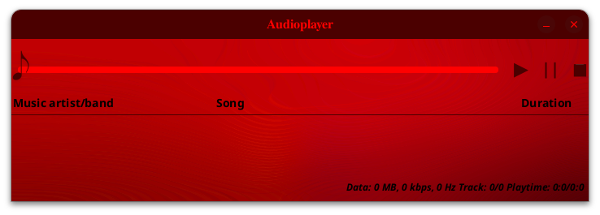
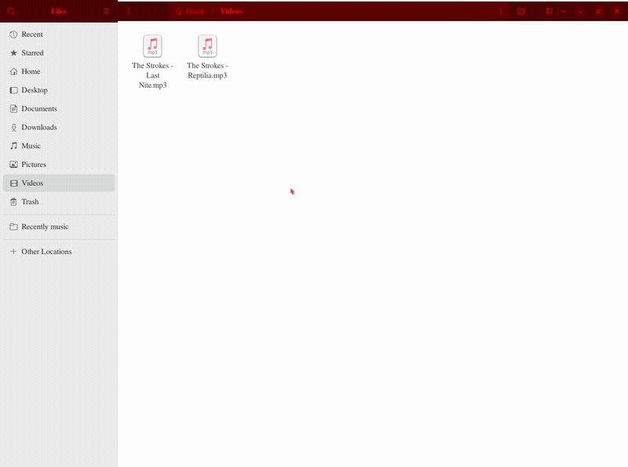

# Audioplayer
This is audioplayer with ability to edit audiotrack metadata and properties

## Functional
The app allows to play, pause, stop and rewind audiotracks. Audiotrack can be opened in audioplayer by double-click, drag and drop or context menu; when opening another audiotrack by double-click or context menu current playback is replaced with new track. There is ability to create playlist, edit metadata (only artist and title, other metadata is cleared) and properties (only convert to 320 kbps, 44100 Hz, stereo). The information at the app bottom shows playing audiofile size and playing audiotrack bitrate/sample rate/channel, playing audiotrack number to total audiotracks count, playing audiotrack duration to played audiotracks duration to total audiotracks duration. Also it is possible to open audiotrack on Last.fm

## Stack
\- Java  
\- FFmpeg
